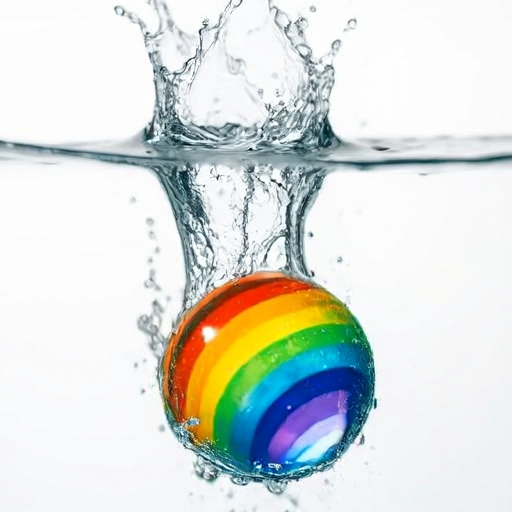

# DRA-Ctrl

This is the official implementation of DRA-Ctrl.

## Dimension-Reduction Attack! Video Generative Models are Experts on Controllable Image Synthesis

by *Hengyuan Cao, Yutong Feng, Biao Gong, Yijing Tian, Yunhong Lu, Chuang Liu, and Bin Wang*

[](https://arxiv.org/abs/2505.23325)
[](https://arxiv.org/pdf/2505.23325)
[](https://dra-ctrl-2025.github.io/DRA-Ctrl/)
[](https://huggingface.co/your-model)
[](https://github.com/Kunbyte-AI/DRA-Ctrl)

## ✅ TODOs

- [x] release code
- [ ] release checkpoints

## 🔍 Introduction

> **<h3>Abstract</h3>**
> Video generative models can be regarded as world simulators due to their ability to capture dynamic, continuous changes inherent in real-world environments. 
> These models integrate high-dimensional information across visual, temporal, spatial, and causal dimensions, enabling predictions of subjects in various status. 
> A natural and valuable research direction is to explore whether a fully trained video generative model in high-dimensional space can effectively support lower-dimensional tasks such as controllable image generation. 
> In this work, we propose a paradigm for video-to-image knowledge compression and task adaptation, termed *Dimension-Reduction Attack* (`DRA-Ctrl`), which utilizes the strengths of video models, including long-range context modeling and flatten full-attention, to perform various generation tasks. 
> Specially, to address the challenging gap between continuous video frames and discrete image generation, we introduce a mixup-based transition strategy that ensures smooth adaptation. 
> Moreover, we redesign the attention structure with a tailored masking mechanism to better align text prompts with image-level control. 
> Experiments across diverse image generation tasks, such as subject-driven and spatially conditioned generation, show that repurposed video models outperform those trained directly on images. 
> These results highlight the untapped potential of large-scale video generators for broader visual applications. 
> `DRA-Ctrl` provides new insights into reusing resource-intensive video models and lays foundation for future unified generative models across visual modalities.


## 🚀 Quick Start

### Dependencies
```
conda create --name dra_ctrl python=3.12
pip install -r requirements.txt
```
### Checkpoints
We use [the community fork](https://huggingface.co/hunyuanvideo-community/HunyuanVideo-I2V)  for Diffusers-format weights on [tencent/HunyuanVideo-I2V](https://huggingface.co/tencent/HunyuanVideo-I2V) as the initialization parameters for the model.

You can download the LoRA weights for various tasks of DRA-Ctrl at [this link]().

The checkpoint directory is shown below.
```
DRA-Ctrl/
└── ckpts/
    ├── HunyuanVideo-I2V/
    |   ├── image_processor/
    |   ├── scheduler/
    |       ...
    ├── depth-anything-small-hf
    |   ├── model.safetensors
    |       ...
    ├── canny.safetensors
    ├── coloring.safetensors
    ├── deblurring.safetensors
    ├── depth.safetensors
    ├── depth_pred.safetensors
    ├── fill.safetensors
    ├── sr.safetensors
    ├── subject_driven.safetensors
    └── style_transfer.safetensors
```

### Get Started

```
python gradio_app.py --config configs/gradio.yaml
```

For easier testing, in ​spatially-aligned image generation tasks, when passing the condition image to `gradio_app`, there's no need to manually input edge maps, depth maps, or other condition images - only the original image is required. The corresponding condition images will be automatically extracted.

You can use the `*_test.jpg` or `*_test.png` images from the assets folder as ​condition images​ for input to `gradio_app`, which will generate the following examples:

Examples:
|               Task              |          Condition Image         |                                                                 Target Prompt                                                                |                                                     Condition Image Prompt                                                    |           Target Image           |
|:-------------------------------:|:--------------------------------:|:--------------------------------------------------------------------------------------------------------------------------------------------:|:-----------------------------------------------------------------------------------------------------------------------------:|:--------------------------------:|
|          Canny to Image         |           |                   Mosquito frozen in clear ice cube on sand, glowing sunset casting golden light with misty halo around ice                  |                                                               -                                                               |           |
|           Colorization          |        |          A vibrant young woman with rainbow glasses, yellow eyes, and colorful feather accessory against a bright yellow background          |                                                               -                                                               |        |
|            Deblurring           |      |                 Vibrant rainbow ball creates dramatic splash in clear water, bubbles swirling against crisp white background                 |                                                               -                                                               |      |
|          Depth to Image         |           |                  Golden-brown cat-shaped bread loaf with closed eyes rests on wooden table, soft kitchen blur in background                  |                                                               -                                                               |           |
|         Depth Prediction        |      |                 Steaming bowl of ramen with pork slices, soft-boiled egg, greens, and scallions in rich broth on wooden table                |                                                               -                                                               |      |
|         In/Out-painting         |            |                          Mona Lisa dons a medical mask, her enigmatic smile now concealed beneath crisp white fabric                         |                                                               -                                                               |            |
|         Super-resolution        |              |          Crispy buffalo wings and golden fries rest on a red-and-white checkered paper lining a gleaming metal tray, with creamy dip         |                                                               -                                                               |              |
| Subject-driven image generation |  |                                                            The woman stands in a snowy forest, captured in a half-portrait outfit                                                            |                                                             Woman in cream knit sweater sits calmly by a crackling fireplace, surrounded by warm candlelight and rustic wooden shelves                                                             |  |
|          Style Transfer         |  | bitmoji style. An orange cat sits quietly on the stone slab. Beside it are the green grasses. With its ears perked up, it looks to one side. | An orange cat sits quietly on the stone slab. Beside it are the green grasses. With its ears perked up, it looks to one side. |  |

## 📋 Citation

If you find our work helpful, please cite:
```
@misc{cao2025dimensionreductionattackvideogenerative,
      title={Dimension-Reduction Attack! Video Generative Models are Experts on Controllable Image Synthesis}, 
      author={Hengyuan Cao and Yutong Feng and Biao Gong and Yijing Tian and Yunhong Lu and Chuang Liu and Bin Wang},
      year={2025},
      eprint={2505.23325},
      archivePrefix={arXiv},
      primaryClass={cs.CV},
      url={https://arxiv.org/abs/2505.23325}, 
      }
```

## Acknowledgements
We would like to thank the contributors to the [HunyuanVideo](https://github.com/Tencent-Hunyuan/HunyuanVideo), [HunyuanVideo-I2V](https://github.com/Tencent-Hunyuan/HunyuanVideo-I2V), [diffusers](https://github.com/huggingface/diffusers) and [HuggingFace](https://huggingface.co/) repositories, for their open research and exploration.